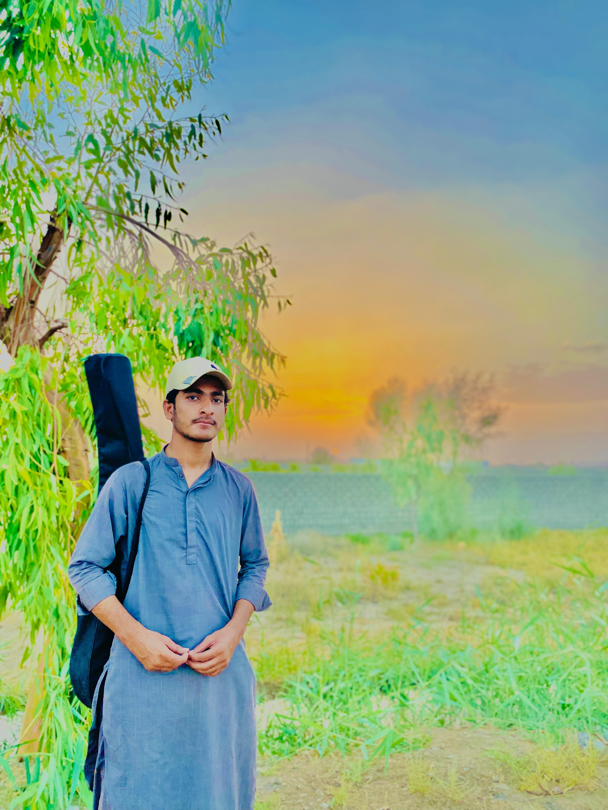
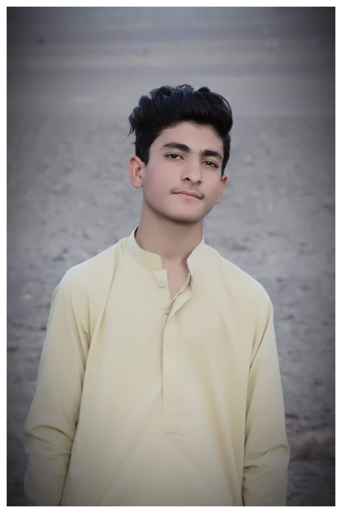

/* Reset some default styling */
* {
    margin: 0;
    padding: 0;
    box-sizing: border-box;
    color: #333;
}
audio{
    border-radius: 10px;
    width: 200px;
}
.music1{
    height: 500px;
    background: rgba(255, 255, 255, 0.15);
    box-shadow: 0 8px 32px 0 rgba(31, 38, 135, 0.37);
    backdrop-filter: blur(2.5px);
    -webkit-backdrop-filter: blur(2.5px);
    border-radius: 10px;
    border: 1px solid rgba(255, 255, 255, 0.18);
}

strong {
    color: #8b83e6;
    font-size: 1.5rem;
}

.profile {
    width: 300px;
    height: 300px;
    box-shadow: red;
}

.profile img {
    border-radius: 50%;
    width: 300px;
    height: 300px;
}

h1, h2 {
    color: #fff;
    font-size: 2rem;
}

label {
    color: #fff;
}

p {
    color: #fff;
}

body {
    width: 100%;
    height: 100%;
    background: #0f0c29;
    background: -webkit-linear-gradient(to right, #24243e, #302b63, #0f0c29);
    background: linear-gradient(to right, #24243e, #302b63, #0f0c29);
    font-family: 'Noto Sans', sans-serif;
    padding: 0;
    margin: 0;
    display: flex;
    flex-direction: column;
    scroll-behavior: smooth; /* Smooth scrolling for section navigation */
}

/* Sidebar styling with glassmorphism and sticky position */
.sidebar {
    position: fixed;
    top: 0;
    width: 200px;
    height: 100vh;
    padding-top: 20px;
    background: rgba(255, 255, 255, 0.15);
    box-shadow: 0 8px 32px 0 rgba(31, 38, 135, 0.37);
    backdrop-filter: blur(2.5px);
    -webkit-backdrop-filter: blur(2.5px);
    border-radius: 10px;
    border: 1px solid rgba(255, 255, 255, 0.18);
}

.sidebar a {
    display: block;
    color: white;
    padding: 10px;
    text-align: center;
    text-decoration: none;
}

.sidebar a:hover {
    background-color: rgba(255, 255, 255, 0.2);
    border-radius: 5px;
}

.sidebar .glass a.active {
    background-color: rgba(255, 255, 255, 0.5);
    color: black;
    border-radius: 5px;
}

/* Apply glassmorphism to all sections */
.glass {
    background: rgba(255, 255, 255, 0.15);
    box-shadow: 0 8px 32px 0 rgba(31, 38, 135, 0.37);
    backdrop-filter: blur(2.5px);
    -webkit-backdrop-filter: blur(2.5px);
    border-radius: 10px;
    border: 1px solid rgba(255, 255, 255, 0.18);
}

/* Section styling */
.section {
    min-height: 100vh; /* Full viewport height */
    padding: 40px;
    margin-left: 220px; /* Offset for the sidebar */
    display: flex;
    flex-direction: column;
    align-items: center;
    margin-bottom: 20px;
}

/* Gallery specific styling */
.section-title {
    margin-bottom: 20px;
    font-size: 2rem;
    color: #fff;
}

.gallery-grid {
    display: grid;
    grid-template-columns: repeat(auto-fit, minmax(200px, 1fr));
    grid-gap: 20px;
    width: 100%;
    background: rgba(255, 255, 255, 0.15);
    box-shadow: 0 8px 32px 0 rgba(31, 38, 135, 0.37);
    backdrop-filter: blur(2.5px);
    padding: 0;
    overflow: hidden; /* Ensure content does not overflow */
}

.gallery-item {
    position: relative;
    overflow: hidden;
    border-radius: 10px;
}

.gallery-item img {
    width: 100%;
    height: auto;
    border-radius: 10px;
    box-shadow: 0 4px 8px rgba(0, 0, 0, 0.1);
    transition: transform 0.2s ease-in-out;
}

.gallery-item img:hover {
    transform: scale(1.05);
}

/* Responsive adjustments */
@media screen and (max-width: 800px) {
    .section {
        margin-left: 0;
        padding: 20px;
    }

    .gallery-grid {
        grid-template-columns: repeat(auto-fit, minmax(150px, 1fr));
        grid-gap: 10px;
    }
}

@media screen and (max-width: 600px) {
    .section {
        padding: 15px;
    }

    .gallery-grid {
        grid-template-columns: repeat(auto-fit, minmax(120px, 1fr));
        grid-gap: 8px;
    }

    .section-title {
        font-size: 1.5rem;
    }
    
    .gallery-grid {
        position: relative;
        height: auto; /* Adjust height to fit content */
    }

    .gallery-item {
        width: 100%;
        height: auto;
        display: flex;
        align-items: center;
        justify-content: center;
    }

    .gallery-item img {
        width: 100%;
        height: auto;
        object-fit: cover;
    }
}

/* Contact form styling with glassmorphism */
form {
    display: flex;
    flex-direction: column;
    align-items: center;
    width: 100%;
}

form input, form textarea {
    width: 100%;
    max-width: 400px;
    padding: 10px;
    margin: 10px 0;
    border-radius: 5px;
    border: 1px solid rgba(255, 255, 255, 0.18);
    background: rgba(255, 255, 255, 0.15);
    box-shadow: 0 8px 32px 0 rgba(31, 38, 135, 0.37);
    backdrop-filter: blur(2.5px);
    -webkit-backdrop-filter: blur(2.5px);
    color: white;
}

form button {
    background-color: rgba(255, 255, 255, 0.15);
    color: #fff;
    padding: 10px 20px;
    border: none;
    border-radius: 5px;
    cursor: pointer;
    box-shadow: 0 8px 32px 0 rgba(31, 38, 135, 0.37);
    border: 1px solid rgba(255, 255, 255, 0.18);
}

form button:hover {
    background-color: rgba(255, 255, 255, 0.25);
}

/* About section specific styling */
.about-content {
    max-width: 800px;
    text-align: center;
}

.about-content p {
    margin: 20px 0;
    line-height: 1.6;
    color: #ffffff; /* Adjust text color for better readability */
}

.about-content h2 {
    margin-bottom: 20px;
    font-size: 2rem;
    color: #fff;
}

/* Footer styling with glassmorphism */
.footer {
    padding: 20px;
    background: rgba(255, 255, 255, 0.15);
    box-shadow: 0 8px 32px 0 rgba(31, 38, 135, 0.37);
    backdrop-filter: blur(2.5px);
    -webkit-backdrop-filter: blur(2.5px);
    border-radius: 10px;
    border: 1px solid rgba(255, 255, 255, 0.18);
    text-align: center;
    margin-left: 220px; /* Offset for the sidebar */
    color: white;
}

/* Responsive design adjustments */
@media screen and (max-width: 800px) {
    .sidebar {
        width: 100%;
        height: auto;
        position: relative;
    }

    .section {
        margin-left: 0;
        padding: 20px;
    }
}

/* Mobile view styling */
@media screen and (max-width: 600px) {
    .gallery-grid {
        position: relative;
        width: 100%;
        height: auto; /* Adjust height to fit content */
        overflow: hidden;
    }

    .gallery-item {
        width: 100%;
        height: auto;
        display: flex;
        align-items: center;
        justify-content: center;
    }

    .gallery-item img {
        width: 100%;
        height: auto;
        object-fit: cover;
    }
}

html???????
<!DOCTYPE html>
<html lang="en">
<head>
    <meta charset="UTF-8">
    <meta name="viewport" content="width=device-width, initial-scale=1.0">
    <title>Singer Portfolio</title>
    
        
    <link rel="stylesheet" href="css/style.css">
</head>
<body>

    <!-- Sidebar -->
    

        <a  href="#home">Home</a>
        <a href="#gallery">Gallery</a>
        <a href="#contact">Contact</a>
        <a href="#about">About</a>
    

    <!-- Header Section -->
    <section id="home" class="section header glass">
        

            
        

        <h1>Balach Hashmi</h1>
        
Singer | Writer | Producer

    </section>

    <!-- About Section -->
<section id="about" class="section glass">
    <h2>About Balach Hashmi</h2>
    

        
<strong>A Journey Through Soulful Melodies</strong>

        
Balach Hashmi is not just a name; it's a symphony of soulful melodies and captivating performances that echo the rich cultural heritage of Balochistan. From the heart of the Balochi music tradition, Balach Hashmi has emerged as a beacon of authenticity and artistic brilliance.

        
<strong>Early Beginnings</strong>

        
Born and raised in Balochistan, Balach Hashmi's journey into the world of music began at a young age. Surrounded by the lush landscapes and the vibrant cultural tapestry of his homeland, he was deeply influenced by traditional Balochi folk music. His early exposure to local musical styles and rhythms ignited a passion that would shape his future.

        
<strong>A Unique Sound</strong>

        
Balach's music is a blend of traditional Balochi folk and contemporary influences, creating a sound that is both timeless and fresh. His powerful vocals, combined with intricate instrumental arrangements, transport listeners to a world where tradition meets innovation. Each performance is a testament to his commitment to preserving and evolving the musical heritage of Balochistan.

        
<strong>Cultural Ambassador</strong>

        
Beyond his musical achievements, Balach Hashmi is a cultural ambassador for Balochistan. Through his music, he brings attention to the stories, struggles, and beauty of his people. His songs often reflect themes of love, unity, and resilience, resonating with audiences across different cultures and backgrounds.

        
<strong>Discography and Performances</strong>

        
With a discography that spans several albums and singles, Balach Hashmi has captivated audiences both locally and internationally. His live performances are celebrated for their energy and emotional depth, showcasing his ability to connect with his audience on a personal level. Each concert is a celebration of Balochi culture and music, leaving a lasting impression on all who attend.

        
<strong>The Vision</strong>

        
Looking forward, Balach Hashmi aims to continue his journey of musical exploration and cultural representation. His vision is to bridge the gap between traditional Balochi music and global audiences, sharing the richness of his heritage with the world. Through innovation and dedication, he hopes to inspire the next generation of musicians and music lovers.

        
<strong>Join the Journey</strong>

        
Balach Hashmi invites you to join him on this musical journey. Explore his discography, attend his performances, and experience the soulful sounds that define his artistry. Follow his story and be part of a movement that celebrates the beauty and diversity of Balochi music.

    

</section>

    <!-- Gallery Section -->
    <section id="gallery" class="section gallery glass">
        <h2>Gallery</h2>
        

            
                

                

                

                

                

                

                

                

                <!-- Add more gallery items as needed -->
        

    </section>

    <!-- Music Section -->
    <section id="music" class="section music glass">
        <h2>Music</h2>
        

            <audio controls>
                <source src="music/song1.mp3" type="audio/mp3">
                Your browser does not support the audio tag.
            </audio>
        

    </section>

    <!-- Contact Section -->
    <section id="contact" class="section contact glass">
        <h2>Contact</h2>
        <form id="contact-form">
            <label for="name">Name</label>
            <input type="text" id="name" name="name" required>
            
            <label for="email">Email</label>
            <input type="email" id="email" name="email" required>
            
            <label for="message">Message</label>
            <textarea id="message" name="message" required></textarea>
            
            <button type="submit">Send Message</button>
        </form>
            <!-- Footer -->
   

    </section>
    <footer class="footer glass">
        
&copy; 2024 Balach Hashmi. All rights reserved.

    </footer>

    
</body>
</html>
